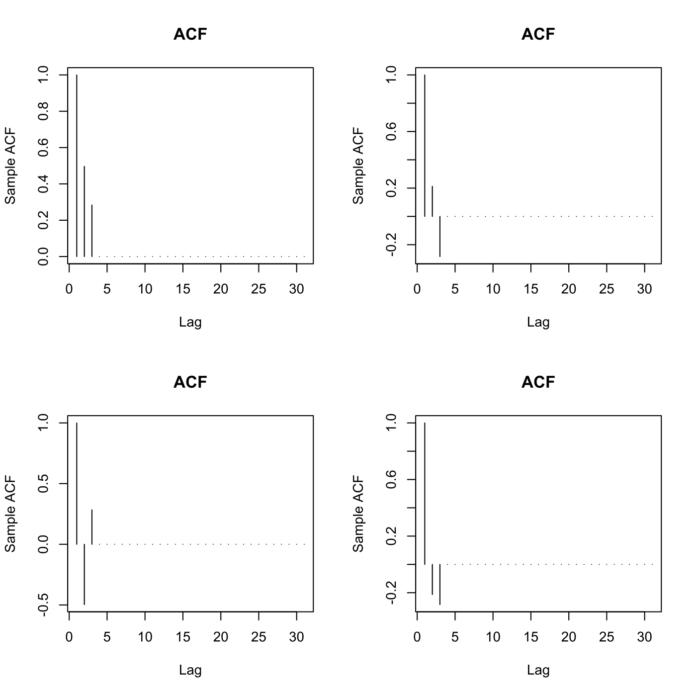
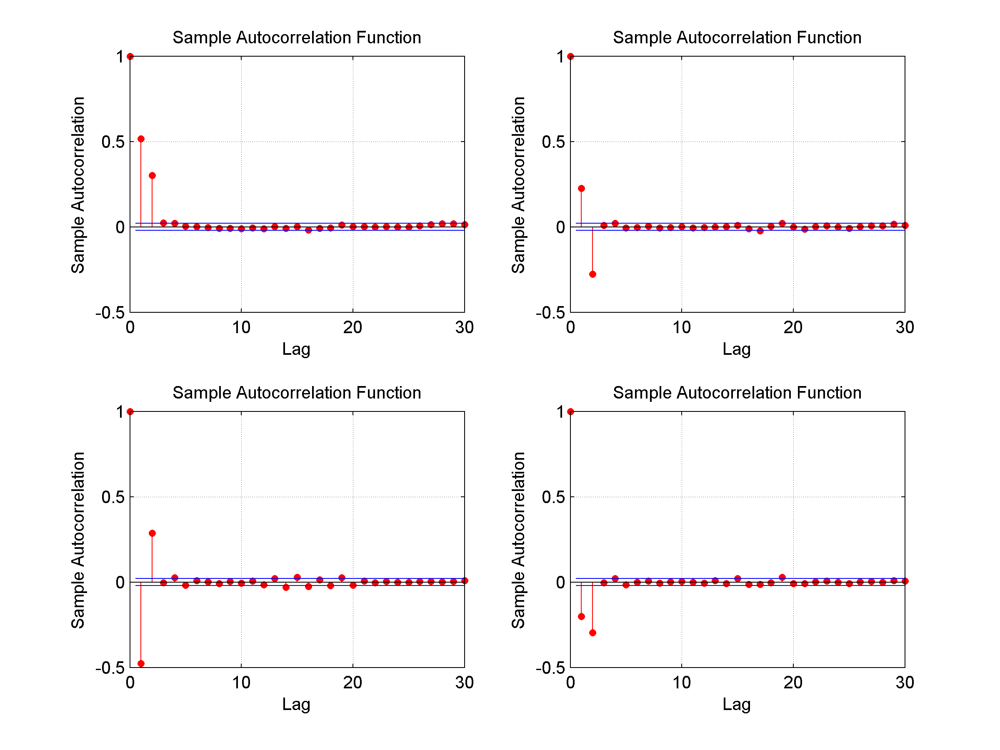

[](http://quantlet.de/index.php?p=info)

## [](http://quantlet.de/) **SFEacfma2**[](http://quantlet.de/d3/ia)

```yaml
Name of QuantLet : SFEacfma2

Published in: Statistics of Financial Markets

Description: 'Plots the autocorrelation function of a MA(2) (moving average) process for different parameters.'

Keywords:
- acf
- arma
- autocorrelation
- correlation
- discrete
- graphical representation
- linear
- moving-average
- plot
- process
- simulation
- stationary
- stochastic
- stochastic-process
- time-series

See also:
- SFEacfar1
- SFEacfar2
- SFEacfma1
- SFEpacfma2

Author: Joanna Tomanek

Author [Matlab]: Ying Chen, Christian Hafner, Lasse Groth

Submitted: Mon, June 08 2015 by Lukas Borke

Example: 'Plots the ACF of a MA(2) process with beta1=0.5, beta2=0.4 (top left), beta1=0.5, beta2=-0.4 (top right), beta1=-0.5, beta2=0.4 (bottom left) and beta1=-0.5, beta2=-0.4 (bottom right).'

```




### R Code:
```r

rm(list = ls(all = TRUE))
graphics.off()

# parameter settings
lag	= 30	# lag value
b1	= 0.5	# value of beta_1
b2	= 0.4	# value of beta_2

par(mfrow = c(2, 2))

plot(ARMAacf(ar = numeric(0), ma = c(b1, b2), lag.max = lag, pacf = FALSE), 
    type = "h", xlab = "Lag", ylab = "Sample ACF")
title("ACF")

plot(ARMAacf(ar = numeric(0), ma = c(b1, -b2), lag.max = lag, pacf = FALSE), 
    type = "h", xlab = "Lag", ylab = "Sample ACF")
title("ACF")

plot(ARMAacf(ar = numeric(0), ma = c(-b1, b2), lag.max = lag, pacf = FALSE), 
    type = "h", xlab = "Lag", ylab = "Sample ACF")
title("ACF")

plot(ARMAacf(ar = numeric(0), ma = c(-b1, -b2), lag.max = lag, pacf = FALSE), 
    type = "h", xlab = "Lag", ylab = "Sample ACF")
title("ACF") 
```
### Matlab Code
```matlab
clear
clc
close all

% user inputs parameters
disp('Please input lag value lag, value of beta1, value of beta2 as: [30, 0.5, 0.4]') 
disp(' ') ;
para = input('[lag, beta1, beta2]=');

while length(para) < 3
    disp('Not enough input arguments. Please input in 1*3 vector form like [30, 0.5, 0.4] or [30 0.5 0.4]');
    para = input('[lag, beta1, beta2]=');
end

lag   = para(1);
beta1 = para(2);
beta2 = para(3);

% main computation
randn('state', 0)                      % Start from a known state.
x  = randn(10000, 1);                   % 10000 Gaussian deviates ~ N(0, 1).
y1 = filter([1 beta1 beta2], 1, x);    % Create an MA(2) process.
y2 = filter([1 beta1 -beta2], 1, x);   % Create an MA(2) process.
y3 = filter([1 -beta1 beta2], 1, x);   % Create an MA(2) process.
y4 = filter([1 -beta1 -beta2], 1, x);  % Create an MA(2) process.

subplot(2, 2, 1)
autocorr(y1, lag, [], 2);              % Plot ACF for β1 = 0.5, β2 = 0.4
subplot(2, 2, 2)
autocorr(y2, lag, [], 2);              % Plot ACF for β1 = 0.5, β2 = −0.4
subplot(2, 2, 3)
autocorr(y3, lag, [], 2);              % Plot ACF for β1 = −0.5, β2 = 0.4
subplot(2, 2, 4)
autocorr(y4, lag, [], 2);              % Plot ACF for β1 = −0.5, β2 = −0.4
```
