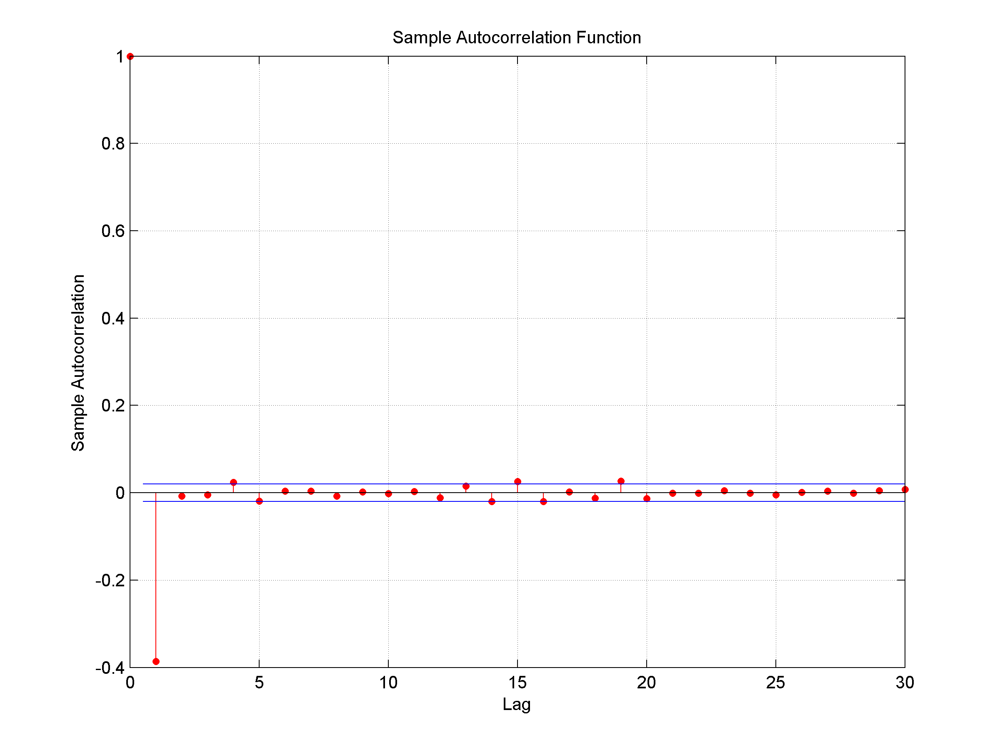

[](http://quantlet.de/index.php?p=info)

## [](http://quantlet.de/) **SFEacfma1**[](http://quantlet.de/d3/ia)

```yaml
Name of QuantLet : SFEacfma1 

Published in: Statistics of Financial Markets

Description: Plots the autocorrelation function of an MA(1) (moving average) process.

Keywords: acf, autocorrelation, discrete, graphical representation, linear, moving-average, plot, process, simulation, stationary, stochastic, stochastic-process, time-series

See also: SFEacfar1, SFEacfar2, SFEacfma2, SFElikma1, SFEpacfar2, SFEpacfma2, SFEplotma1

Author: Joanna Tomanek

Author [Matlab]: Ying Chen, Christian Hafner

Submitted: Fri, July 24 2015 by quantomas

Input:
- lag : lag value
- b : beta_1

Example:
- 1: b = 0.5, lag = 30.
- 2: b = -0.5, lag = 30.

```





### R Code:
```r
# clear variables and close windows
rm(list = ls(all = TRUE))
graphics.off()

# parameter settings
lag = "30"      # lag value
b   = "0.5"     # value of beta_1

# Input beta_1
message = "      input beta"
default = b
b       = winDialogString(message, default)
b       = type.convert(b, na.strings = "NA", as.is = FALSE, dec = ".")

# Input lag value
message = "      input lag"
default = lag
lag     = winDialogString(message, default)
lag     = type.convert(lag, na.strings = "NA", as.is = FALSE, dec = ".")

# Plot
plot(ARMAacf(ar = numeric(0), ma = b, lag.max = lag, pacf = FALSE), type = "h", xlab = "lag", 
    ylab = "acf")
title("Sample autocorrelation function (acf)") 
```
### Matlab Code
```matlab
% user inputs parameters
disp('Please input lag value lag, value of beta1 beta as: [30, 0.5]') ;
disp(' ') ;
para=input('[lag, beta]=');

while length(para) < 2
    disp('Not enough input arguments. Please input in 1*2 vector form like [30, 0.5] or [30 0.5]');
    para = input('[lag, beta]=');
end

lag  = para(1);
beta = para(2);

% main computation
randn('state', 0)              % Start from a known state.
x = randn(10000, 1);           % 10000 Gaussian deviates ~ N(0, 1).
y = filter([1 beta], 1, x);    % Create an MA(1) process.
autocorr(y, lag, [], 2);       % Plot
```
