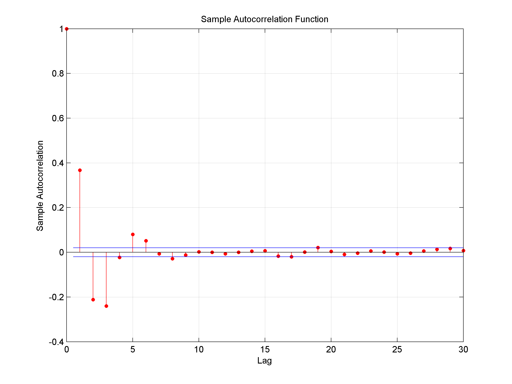
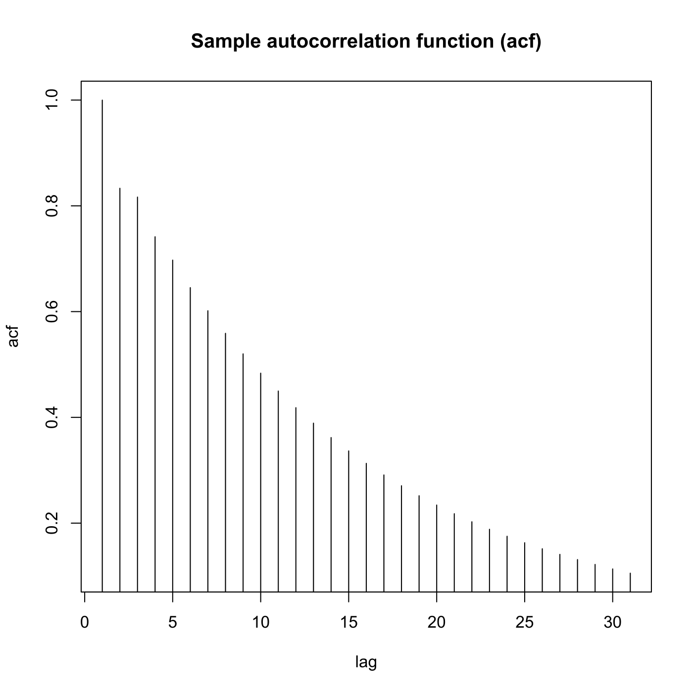
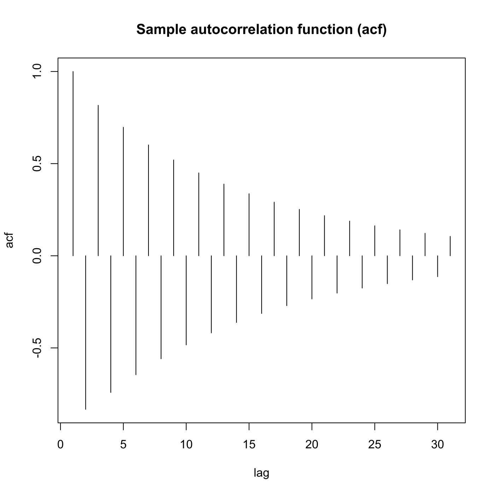

[](http://quantlet.de/index.php?p=info)

## [](http://quantlet.de/) **SFEacfar2**[](http://quantlet.de/d3/ia)

```yaml
Name of QuantLet : SFEacfar2 

Published in: Statistics of Financial Markets

Description: Plots the autocorrelation function of an AR(2) (autoregressive) process.

Keywords: acf, autocorrelation, autoregressive, discrete, graphical representation, linear, plot, process, simulation, stationary, stochastic, stochastic-process, time-series

See also: SFEacfar1, SFEacfma1, SFEacfma2, SFElikma1, SFEpacfar2, SFEpacfma2, SFEplotma1

Author: Joanna Tomanek

Author[Matlab]: Christian Hafner

Submitted: Fri, July 24 2015 by quantomas

Input:
- lag : lag value
- a1 : alpha_1
- a2 : alpha_2

Example:
- 1: a1=0.5, a2=0.4 and lag=30
- 2: a1=0.5, a2=-0.4 and lag=30.
- 3: a1=-0.5, a2=0.4 and lag=30.
- 4: a1=-0.5, a2=-0.4 and lag=30.

```










### R Code:
```r
# clear variables and close windows
rm(list = ls(all = TRUE))
graphics.off()

# parameter settings
lag = "30"  	# lag value
a1  = "0.5"  	# value of alpha_1
a2  = "0.4"  	# value of alpha_2

# Input alpha1
message = "input alpha1"
default = a1
a1      = winDialogString(message, default)
a1      = type.convert(a1, na.strings = "NA", as.is = FALSE, dec = ".")

# Input alpha2
message = "input alpha2"
default = a2
a2      = winDialogString(message, default)
a2      = type.convert(a2, na.strings = "NA", as.is = FALSE, dec = ".")

# Input lag
message = "input lag"
default = lag
lag     = winDialogString(message, default)
lag     = type.convert(lag, na.strings = "NA", as.is = FALSE, dec = ".")

# Plot ACF with alpha_1=a1, alpha_2=a2
plot(ARMAacf(ar = c(a1, a2), ma = numeric(0), lag.max = lag, pacf = FALSE), type = "h", 
    xlab = "lag", ylab = "acf")
title("Sample autocorrelation function (acf)") 
```
### Matlab Code
```matlab
% user inputs parameters
disp('Please input lag value lag, value of alpha1 a_1, value of alpha_2 a2 as: [30, 0.5 0.4]') ;
disp(' ') ;
para = input('[lag, a1, a2]=');

while length(para) < 3
    disp('Not enough input arguments. Please input in 1*3 vector form like [30, 0.5, 0.4] or [30 0.5 0.4]');
    para=input('[lag, a1, a2]=');
end

lag = para(1);
a1  = para(2);
a2  = para(3);

% main computation
randn('state', 0);                % Start from a known state.
x = randn(10000, 1);              % 10000 Gaussian deviates ~ N(0, 1).
y = filter(1, [1 -a1 -a2], x);    % Create an AR(2) process.
autocorr(y, lag, [], 2);          % Plot the acf with 95% CI
```
